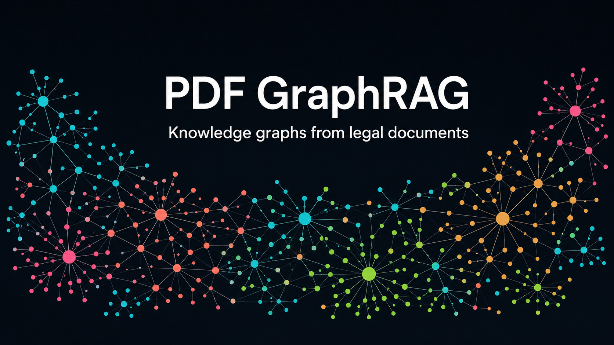
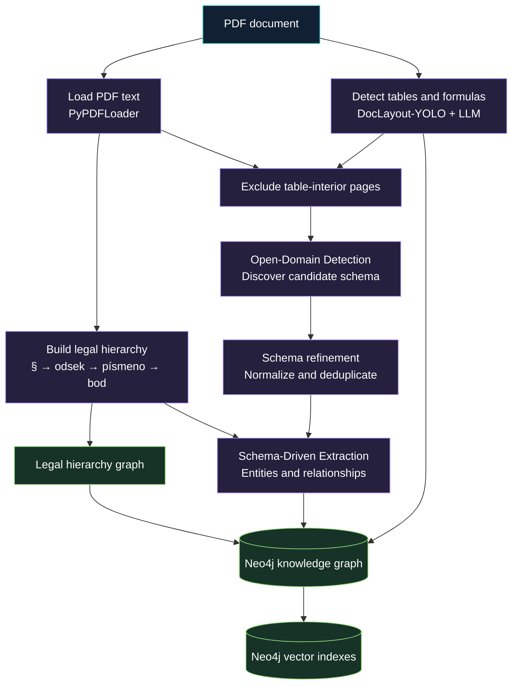

# PDF GraphRAG for Slovak Legal Documents

<p align="center">
  
</p>

<p align="center">
  Turn Slovak legal and financial PDFs into a queryable Neo4j knowledge graph with structured legal context, tables, formulas, and semantic relationships.
</p>

<p align="center">
  <a href="#quick-start">Quick start</a> ·
  <a href="#pipeline">Pipeline</a> ·
  <a href="#evaluation">Evaluation</a> ·
  <a href="#limitations">Limitations</a>
</p>

> **Status:** research and experimentation project. The current structural parser is tailored to Slovak financial-law PDFs and needs adaptation before it is used for other document styles or production workloads.

## Overview

This repository implements a PDF-to-knowledge-graph pipeline for Slovak legal and financial documents. It combines deterministic document structure with LLM-based extraction:

- parses the legal hierarchy: `§ → odsek → písmeno → bod`;
- detects tables and formulas in PDFs with DocLayout-YOLO, then converts them into graph data with an LLM;
- discovers a domain schema from document text, refines it, and extracts entities and relationships constrained by that schema;
- writes the resulting graph into Neo4j and builds vector indexes for chunks, nodes, and relationship types;
- provides cached intermediate results and an evaluation harness for graph-extraction quality.

The result preserves both **what the document says** and **where it appears in the legal structure**. For example, an extracted obligation can be connected to its source paragraph, section, and document rather than existing as an isolated triple.

## Pipeline



| Stage | What it produces | Why it matters |
| --- | --- | --- |
| Table and formula extraction | Table nodes/relationships and formula nodes | Keeps structured content out of plain-text extraction and preserves data that text extraction can lose. |
| Structural chunking | Self-contained legal chunks plus a document hierarchy graph | Supplies the extractor with paragraph-level context and traceability. |
| Open-Domain Detection (ODD) | Candidate node and relationship types from each text chunk | Lets the schema emerge from the source material rather than requiring a fixed ontology. |
| Schema refinement | A deduplicated, normalized schema merged with the existing Neo4j schema | Ensures consistent labels and relationship names between runs. |
| Schema-Driven Extraction (SDE) | Concrete entities and relationships that conform to the refined schema | Constrains LLM extraction and produces graph documents ready for ingestion. |
| Neo4j ingestion and indexes | Persistent graph and vector stores | Enables Cypher exploration and similarity-based retrieval. |

## Repository layout

```text
.
├── code/
│   ├── main.py                 # Runnable pipeline stages and examples
│   ├── pdf_graphrag.py         # PDFGraphRAG implementation
│   ├── chunker/                # Slovak legal-structure parser
│   ├── prompts.py              # ODD, refinement, and SDE prompts/schemas
│   ├── loaders.py              # Reload cached JSON artifacts
│   ├── to_json.py              # Persist pipeline outputs
│   └── requirements.txt        # Python dependencies
├── test_dataset/
│   ├── evaluation.py           # Graph-extraction evaluation harness
│   └── kg_*_dataset*.json      # Gold validation and test datasets
├── file_output/                # Example generated pipeline artifacts
├── extracted_data/             # Saved extraction experiments
├── presentations/              # Project visuals and thesis materials
└── README.md
```

## Requirements

- Python **3.11+**
- A running **Neo4j 5.x** database. Neo4j Desktop 2 with the **APOC Core** plugin is the simplest local setup.
- An **OpenAI API key** for embeddings and the OpenAI-based extraction flows.
- A **Google API key** when using the Gemini clients included in the pipeline.
- **Poppler** for PDF page rendering used by table and formula detection.

Install Poppler before the Python dependencies:

```bash
# macOS
brew install poppler

# Ubuntu/Debian
sudo apt install poppler-utils
```

The table/formula detector downloads its DocLayout-YOLO weights from Hugging Face the first time it runs.

## Installation

```bash
git clone <your-fork-or-repository-url>
cd llm-knowledge-graph

python3.11 -m venv .venv
source .venv/bin/activate
pip install --upgrade pip
pip install -r code/requirements.txt
```

Create a root `.env` file from the included template:

```bash
cp code/.env.example .env
```

Set at least the provider keys:

```dotenv
OPENAI_API_KEY=sk-...
GOOGLE_API_KEY=AIza...
```

Then update `get_graphrag()` in [`code/main.py`](code/main.py) with the URI, username, password, and database name for your Neo4j instance. Those connection values are currently explicit configuration in code; the `.env` template documents them but `main.py` does not yet read the `NEO4J_*` variables automatically.

## Quick start

The most direct way to process a document is to create `PDFGraphRAG` and run its end-to-end method. Run the following from the repository root after configuring Neo4j and `.env`:

```python
import os
import sys

sys.path.insert(0, "code")

from dotenv import load_dotenv
from pdf_graphrag import PDFGraphRAG

load_dotenv()

graphrag = PDFGraphRAG(
    neo4j_uri="neo4j://127.0.0.1:7687",
    neo4j_user="neo4j",
    neo4j_password="your-neo4j-password",
    database="neo4j",
    openai_api_key=os.getenv("OPENAI_API_KEY"),
    google_api_key=os.getenv("GOOGLE_API_KEY"),
)

graphrag.process(
    "code/assets/ZZ_2004_222_20260101.pdf",
    name_of_chain="vat_law",
    write_json=True,
)
```

`process()` runs the full workflow: tables/formulas, structural chunking, ODD, refinement, SDE, graph ingestion, and vector-index construction. It can take time and incurs provider usage, so the staged workflow below is preferable while iterating on prompts or schema design.

## Run individual stages

[`code/main.py`](code/main.py) exposes each major step independently. This makes failures recoverable and allows results to be reused instead of repeatedly calling an LLM.

```python
import sys

sys.path.insert(0, "code")

from main import (
    build_sde_chunks,
    get_graphrag,
    run_odd,
    run_refinement,
    run_sde,
)

pdf_path = "code/assets/ZZ_2004_222_20260101.pdf"
graphrag = get_graphrag()  # Configure its Neo4j fields first.
documents = graphrag.load_pdf(pdf_path)
document_id = graphrag.get_document_id(pdf_path)

# 1. Discover and refine the schema from ordinary text chunks.
odd_schema = run_odd(graphrag, documents, name="vat_law", write_json=True)
schema = run_refinement(graphrag, odd_schema, name="vat_law", write_json=True)

# 2. Build hierarchy-aware chunks, persist the legal tree, then extract facts.
sde_chunks, tree_graph = build_sde_chunks(pdf_path, documents, write_json=True)
graphrag.add_graph_to_database(tree_graph)

graph_docs = run_sde(
    graphrag,
    sde_chunks,
    schema,
    document_id=document_id,
    name="vat_law",
    write_json=True,
)
graphrag.add_graph_to_database(graph_docs)
graphrag.build_vector_stores()
```

`build_sde_chunks()` must be used before SDE when legal hierarchy matters. It attaches a `path` such as `§ 16a → (2) → c)` to each chunk, and its returned `tree_graph` must be stored before the extracted SDE graph so references to legal sections resolve correctly.

### Cache and resume a run

When `write_json=True`, ODD, refinement, SDE, tables, formulas, chunks, and sections can be written under `file_output/`. The `run_odd`, `run_refinement`, and `run_sde` helpers accept a `cache_path`; if it exists, the corresponding JSON is loaded and the LLM call is skipped.

```python
from main import run_refinement
from loaders import load_odd

odd_schema = load_odd("file_output/vat_law_odd_YYYYMMDDHHMMSS.json")
schema = run_refinement(graphrag, odd_schema, cache_path="file_output/vat_law_ref_YYYYMMDDHHMMSS.json")
```

This is useful after rate limits, interrupted runs, or prompt experiments.

## Graph model and retrieval

The project writes `GraphDocument` objects into Neo4j. Typical structural nodes include `Document`, `Paragraf`, `Odsek`, `Pismeno`, and `Bod`; extracted nodes and relationships are supplied by the refined schema. The structural graph uses `IN_DOCUMENT` and `IN_SECTION` relationships to preserve the source tree.

During ingestion, the implementation normalizes labels and properties for Neo4j compatibility, including removal of diacritics from graph identifiers where needed and camel-casing property keys. `merge_new()` is available for APOC-backed re-ingestion when the latest extraction properties should overwrite matching properties.

Three Neo4j vector indexes are managed for semantic retrieval:

- `chunk_vector_store`
- `nodes_vector_store`
- `relationships_vector_store`

The implementation uses OpenAI `text-embedding-3-large` embeddings for these indexes.

## Tables and formulas

`PDFGraphRAG.tables_and_formulas()` detects layout regions with DocLayout-YOLO, renders relevant pages, and passes the detections through LLM transformations:

- tables are reconstructed as HTML and converted to graph documents;
- formulas are transcribed into LaTeX and represented as graph nodes;
- pages that contain table interiors can be excluded from text ODD/SDE, avoiding duplicate extraction of the same content.

Detected image crops are written to `file_output/tables_and_formulas/` by default. The generated data in `file_output/` and `extracted_data/` provides concrete examples of the resulting JSON structures.

## Evaluation

[`test_dataset/evaluation.py`](test_dataset/evaluation.py) evaluates predicted graph data against the included gold datasets. It first applies deterministic node and relationship matching, then can use an optional LLM judge only for ambiguous entity and relationship matches. Reported measures include node and relationship precision/recall/F1 plus relationship hallucination and omission rates.

The script is currently configured through constants at the start of its `main()` function, including the dataset path, predictions path, output directory, and whether to use the LLM judge. After setting those values to the experiment you want to inspect, run:

```bash
pip install rapidfuzz
python test_dataset/evaluation.py
```

Evaluation reports are written as `summary.json`, `by_chunk.csv` / `by_chunk.json`, predictions, and a Markdown error audit. Existing experiment outputs live under `test_dataset/eval_results/` and `test_dataset/linearized_eval_results/`.

## Development notes

- `code/prompts.py` contains the structured-output contracts and prompts used by ODD, schema refinement, and SDE.
- `code/loaders.py` and `code/to_json.py` provide the JSON round trip used for caching and analysis.
- `code/helpers/transform_md_to_kg.py` and `code/helpers/transform_kg_to_md.py` convert between a human-readable Markdown representation and graph-document JSON.
- `run_sde_sample()` in `code/main.py` processes a reproducible random subset of chunks, which is useful for fast prompt iteration before a full run.
- `PDFGraphRAG.query_graph()` runs Cypher queries directly. Use read-only queries when exploring a graph; `is_read_only_cypher()` is provided as a guard for queries that must not modify the database.

## Limitations

> **Open research question — financial-law ontology design:** The current implementation primarily derives a practical schema or taxonomy of entities and relationships from the supplied text. It is not a complete, formally designed ontology for financial law. Further research into reusable concepts, legal semantics, jurisdiction-specific terminology, and principled ontology design is welcome and would make the resulting graphs more interoperable and analytically robust.

- The legal hierarchy parser is designed for Slovak financial legislation and currently assumes the `§ → odsek → písmeno → bod` layout. It does not reliably handle every amendment, supplement, or arbitrary PDF layout.
- Extraction quality depends on PDF text quality, prompt design, selected models, and the quality of the refined schema.
- A live Neo4j instance is required when constructing `PDFGraphRAG` because the constructor initializes the graph connection and embedding-backed vector-store configuration.
- Full runs can be slow, download model weights on first use, and consume API credits. Use cached artifacts and `run_sde_sample()` during development.
- The codebase is research-oriented; review extracted facts and graph queries before relying on them for legal, financial, or operational decisions.

## License

This project is licensed under the [Apache License 2.0](LICENSE).
